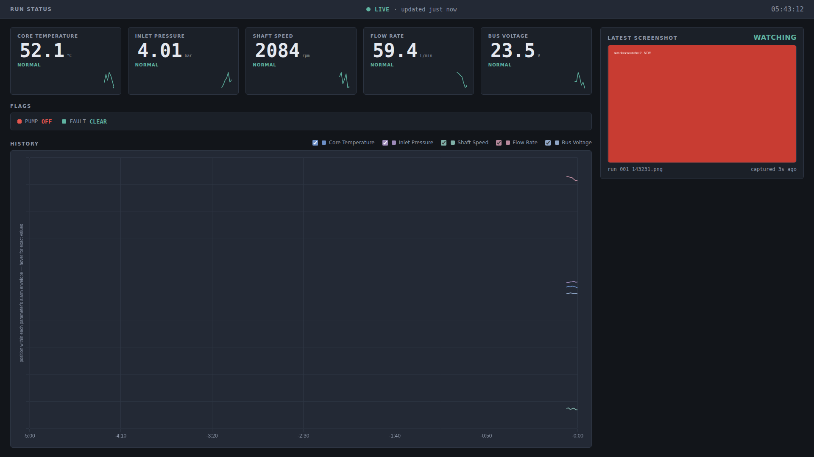
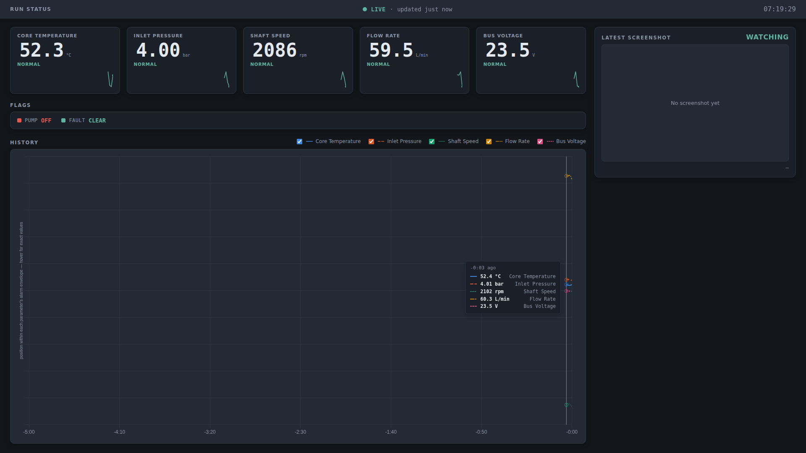

# Simulator Monitoring Dashboard

A browser-based dashboard for watching live parameters from a simulator or
test rig at a glance — live-updating tiles with sparklines, a multi-parameter
history chart, and a panel that auto-detects and displays the newest
screenshot from a watched folder, all visible at once. Built as an instrument
panel, not a marketing page: legible from across a room, colorblind-safe,
and stable enough to run unattended for hours.

**[Live demo →](#) <sub>(replace with your GitHub Pages URL once published — see [Publishing a live demo](#publishing-a-live-demo))</sub>**




## Highlights

- **Zero build step.** Vanilla JavaScript, HTML, and CSS — no npm install,
  no bundler, no framework. Drop the folder on a server, or open
  `index.html` directly, and it runs.
- **Memory-safe for long unattended runs.** History is a fixed-length ring
  buffer, not an unbounded array — stress-tested past 5,000 ingests with
  flat memory.
- **Never signals state by color alone.** Every threshold state carries a
  distinct border weight and a text label alongside its color, so it stays
  usable in greyscale or for colorblind viewers.
- **A validated, colorblind-safe chart palette** — checked with an actual
  CVD-simulation validator, not eyeballed, with dash patterns as a second
  identity channel on top of color.
- **Auto-reconnecting data and screenshot feeds**, independently, with
  capped exponential backoff so a struggling server never gets hammered.
- **A small PHP endpoint watches a folder on disk** for the newest
  screenshot and serves it defensively (extension allowlist, path-traversal
  guard) — because a browser can't read a filesystem directly.

## How to run

**Option A — just open it.** Double-click `index.html`. It ships in mock
mode by default, so you'll see live-looking data immediately with no setup.

**Option B — serve it (recommended for live mode).** Browsers restrict
`fetch()` from `file://` pages in some setups, so if you're pointing at a
real endpoint, serve the folder instead of opening it directly:

```bash
# any static server works, for example:
python3 -m http.server 8080
# or
npx serve .
```

Then visit `http://localhost:8080`.

## Screenshot panel setup

The dashboard also shows the newest screenshot your simulator saves to a
folder on this PC, next to the live parameters — both visible at once, as
required by the brief. This needs a small server-side helper
(`screenshot.php`), because a browser is not allowed to read files from
your PC's filesystem directly — that's a security restriction every
browser enforces, not something specific to this build.

**1. Get PHP running via XAMPP (recommended).** Install
[XAMPP](https://www.apachefriends.org/) — you only need Apache from it,
not MySQL or anything else it bundles. Start Apache from the XAMPP
Control Panel.

**2. Put this project in `htdocs`.** Copy this whole folder into XAMPP's
`htdocs` directory (usually `C:\xampp\htdocs`), so you end up with
`C:\xampp\htdocs\simulator-dashboard\index.html`.

**3. Tell it where your screenshots are.** Open `screenshot.php` in any
text editor and edit the one line near the top:

```php
$screenshotFolder = __DIR__ . '/screenshots';
```

If your simulator's screenshots land somewhere else, change it to that
real folder, for example:

```php
$screenshotFolder = 'C:/Users/yourname/SimulatorScreenshots';
```

(Forward slashes work fine in PHP on Windows and are less error-prone than
escaping backslashes. Also — leave `__DIR__` out once you're writing a
full path yourself; `__DIR__` is only there for the "use the folder that's
already inside this project" default.)

**4. Open the dashboard.** Go to
`http://localhost/simulator-dashboard/index.html` — plain port 80, no
server to start or stop, since Apache runs continuously in the
background. This is the setup verified to work end-to-end.

<details>
<summary>Alternative: run without XAMPP, using PHP's built-in server</summary>

If you have PHP installed some other way (not XAMPP), you can skip the
`htdocs` copy and instead run, from a command prompt in this project's
folder:

```
php -S localhost:8080
```

or double-click `start-server.bat`, which does the same thing — then
visit `http://localhost:8080/index.html`. Leave that command prompt
window open the whole time; closing it stops the server.

Note: port 8080 is a common default for other local dev tools too (Live
Server, other local servers, etc.), so if something's already listening
on it this will fail to start or the page will error. If that happens,
either close whatever else is using port 8080, or just use the XAMPP /
`htdocs` route above instead — it doesn't have this problem, since Apache
owns port 80 and nothing else is likely to be fighting over it.

</details>

Don't need the screenshot panel? Set `screenshot.enabled: false` in
`js/config.js` and skip all of the above — the panel disappears and the
layout goes back to full width, `index.html` opened directly works again.

## How to point it at your real data source

Everything you need to touch lives in **`js/config.js`**. Open it and:

1. Set `mode: "live"` (it's `"mock"` by default).
2. Set `endpoint` to your real URL, e.g. `endpoint: "/api/status"` or a full
   URL like `"http://192.168.1.50:8000/api/status"`.
3. Reload the page.

The endpoint must respond to `GET` with JSON shaped like this:

```json
{
  "timestamp": "2026-08-20T14:32:01.000Z",
  "parameters": [
    { "id": "temp_core", "label": "Core Temperature", "value": 72.4, "unit": "°C" }
  ],
  "flags": [
    { "id": "pump_active", "label": "Pump", "state": true }
  ]
}
```

Notes on the payload:

- `id` is the only field the dashboard actually keys off — `label` and
  `unit` in the payload are ignored in favor of what's configured in
  `config.js`, so your server doesn't need to match wording exactly.
- Missing or malformed fields never crash the page. A parameter with no
  entry in the payload, or a non-numeric `value`, renders as a dash (—),
  never as a zero. Extra fields the dashboard doesn't recognize are
  silently ignored, so you can add server-side fields for other consumers
  without touching this dashboard.
- If your real poll rate needs to go much above ~5 Hz, talk to your
  developer about swapping the chart rendering (`charts.js` / the
  sparklines in `tiles.js`) to [uPlot](https://github.com/leeoniya/uPlot) —
  Chart.js starts to struggle above that rate.

## Editing this project — two config points, not one

`js/config.js` is the only *browser-side* setting file — parameters,
thresholds, endpoint, poll rate, and the screenshot panel's on/off switch
and poll rate all live there.

`screenshot.php`'s one setting (`$screenshotFolder`) is *server-side* — it
has to be, since it's a real path on your PC's disk, which only
server-side code (PHP) can see. If you're not using the screenshot panel,
you'll never need to open this file.

## How to add or change a parameter

Open `js/config.js` and add an entry to the `parameters` array:

```js
{
  id: "oil_temp",           // must match the payload's "id"
  label: "Oil Temperature", // shown on the tile
  unit: "°C",
  decimals: 1,               // digits after the decimal point
  thresholds: { warnMax: 90, critMax: 105 }, // any subset of warnMin/warnMax/critMin/critMax
  showInHistoryChart: true   // include it as a selectable line in the bottom chart
}
```

- `thresholds` is optional — omit it (or leave it `{}`) for a parameter
  with no alarm limits.
- The tile grid reflows automatically (`grid-template-columns:
  auto-fit, minmax(220px, 1fr)`), so adding parameters doesn't require any
  layout changes.
- To add a boolean status flag (like "Pump" or "Fault"), add an entry to
  the `flags` array the same way — see the comments in `config.js`.

No other file needs to change to add a parameter or adjust a threshold.

## Connection status

The header shows one of three states:

- **LIVE** — the last poll succeeded.
- **RECONNECTING** — a poll failed; retrying with backoff (1s → 2s → 5s →
  10s, capped) so a struggling server never gets hammered.
- **DISCONNECTED** — retries have hit the backoff cap. Still trying, just
  slowly. Recovers to LIVE automatically the moment the server responds
  again — no page reload needed.

The "updated Xs ago" readout next to the status turns amber once the last
successful update is older than two poll intervals, so a frozen dashboard
is never mistaken for a live one.

## Threshold and greyscale behavior

Every parameter tile signals its state three ways at once, deliberately —
never by color alone:

1. Border weight (1px normal / 2px warning / 3px critical) and, for
   unknown/missing data, a dashed border.
2. A text state label (NORMAL / WARNING / CRITICAL / UNKNOWN).
3. Color (teal / amber / red), for people with normal color vision.

That means the dashboard stays fully usable printed in greyscale or viewed
by someone with red/green color blindness.

## Memory and long-run behavior

History is stored in a fixed-length ring buffer per parameter — sized from
`historySeconds` and `pollIntervalMs` in `config.js` — so memory use is flat
regardless of how long the page stays open. Nothing in this codebase does
an unbounded `push()` onto a growing array.

## Browser support

Verified in current Chrome. Uses only standard, long-supported web APIs —
`fetch`, `AbortController`, CSS Grid, the Canvas 2D API — nothing
Chrome-specific, so it's expected to behave the same in Firefox, but that
hasn't been directly verified. Worth a quick manual check in Firefox
before calling this done for a client whose PC runs it.

## Project structure

```
/
  index.html
  screenshot.php      — server-side helper for the screenshot panel (needs PHP running)
  start-server.bat     — double-click to run screenshot.php locally on Windows
  /screenshots           — sample/placeholder folder screenshot.php watches by default
  /css
    dashboard.css     — design tokens, layout, all styling
  /js
    config.js         — the browser-side settings file (parameters, endpoint, screenshot toggle...)
    datasource.js      — parameter polling, mock generator, retry/backoff, connection state
    screenshots.js       — screenshot panel polling, same retry/backoff pattern
    store.js               — ring buffer + threshold evaluation
    tiles.js                 — parameter tile rendering + sparklines
    charts.js                  — full-history chart (Chart.js)
    app.js                       — wires it all together
  /vendor
    chart.min.js       — local fallback if the Chart.js CDN is unreachable
  /docs
    screenshot-*.png    — images used in this README
  README.md
```

## Publishing a live demo

The dashboard's parameter side (tiles, sparklines, history chart) is fully
static and runs in mock mode by default, so it's a good fit for a free
static host — useful for a portfolio link or a quick demo without needing
your own PC running.

**GitHub Pages (recommended, free, zero config):**

1. Push this repo to GitHub (see [Pushing to GitHub](#pushing-to-github) below).
2. On GitHub: **Settings → Pages → Source → Deploy from a branch**, pick
   `main` and `/ (root)`, save.
3. GitHub gives you a URL like `https://yourname.github.io/simulator-dashboard/`
   within a minute or two. Drop that into the "Live demo" link at the top
   of this README.

Netlify or Vercel work the same way (connect the repo, no build command,
publish directory `/`) if you'd rather use those.

**The screenshot panel needs a caveat.** GitHub Pages, Netlify, and Vercel
don't run PHP, so `screenshot.php` won't work on a static host — the panel
will just sit in an `ERROR` state, retrying forever in the background
(harmless, but not a great look on a demo link). For a public demo, either:

- Set `screenshot: { enabled: false }` in `js/config.js` on the branch you
  deploy (keep it `true` on your working copy) — the panel disappears
  cleanly and the layout goes full-width, or
- Leave it as-is and mention in your portfolio/proposal that the
  screenshot-watching feature is demoed via the screenshots in this README
  and requires a PHP-capable host (which is also just true of the real
  deployment target — XAMPP on the client's PC).

If you want the *whole* feature set live, including the screenshot panel,
you'd need actual PHP hosting (a small VPS, or a free-tier PHP host) rather
than a static host — more setup, and probably not worth it just for a demo
link.

## Pushing to GitHub

From this project's folder, in a terminal (Git Bash, PowerShell, or Command
Prompt with Git installed):

```bash
git init
git add .
git commit -m "Initial commit: simulator monitoring dashboard"
git branch -M main
git remote add origin https://github.com/<your-username>/<repo-name>.git
git push -u origin main
```

You'll need an empty repository created on GitHub first (github.com → New
repository — don't initialize it with a README, since this project already
has one) and Git installed locally
([git-scm.com](https://git-scm.com/downloads) if you don't have it).

No terminal? GitHub's web UI also accepts drag-and-drop: create the empty
repo, then use **Add file → Upload files** and drag this whole folder in.
That works fine for a one-time push but git (above) is worth learning if
you'll be updating this or future client projects — it's how you'll track
changes and avoid emailing zip files back and forth.

## Out of scope

Per the build spec, the following were explicitly excluded and would need
to be scoped separately: building the simulator's own data output,
historical persistence to disk/database, CSV export, email/SMS alerting,
user accounts, multi-rig support, a mobile layout, and reading actual
*values* out of screenshots (OCR or similar) — the screenshot panel shows
the image itself, it doesn't parse numbers out of it.
